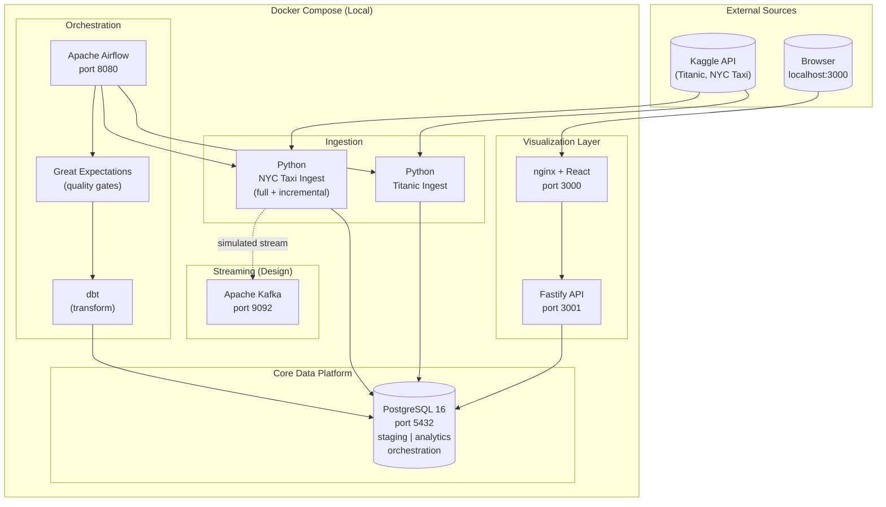

# Production Data Platform — Engineering Reference

> **One contributor. AI-assisted. Production patterns.**
> This repository demonstrates how a single engineer operating with 
> a structured AI collaboration model can produce platform-scale 
> data engineering work that is reviewable, extensible, and 
> documented to the standard of a high-performing team.
> The DEVELOPER_GUIDE is the primary artifact. The code is the evidence.

---

## Why This Repo Exists

This repository is a deliberate demonstration of three things:

**1. Engineering judgment at platform scale.**  
Every architectural decision in this repo is documented before 
implementation. The ADR collection shows how tradeoffs are reasoned 
about, not just resolved. Scale and cost considerations, incremental 
loading strategy, streaming architecture, and infrastructure design 
are all documented as decisions with context and alternatives 
considered. Code that exists without a stated reason is a liability. 
This repo treats that seriously.

**2. Production-shaped patterns, not demo shortcuts.**  
Incremental loading with persisted watermarks. Idempotent upserts with 
hash-based deduplication. Data quality gates that block downstream 
transforms on bad data. Airflow DAGs with retries, backfills, SLA 
callbacks, and operational metadata. Terraform modules with 
dataset-level IAM and inline reasoning. These are not tutorial 
implementations. They are the patterns that survive contact with 
production.

**3. A working model for AI-assisted engineering at scale.**  
AI assistance in this repository operates under a contributor model 
governed by the DEVELOPER_GUIDE. This means ADRs before 
implementation, human review before commit, and convention enforcement 
as a constraint rather than a preference. The model is documented in 
[ADR 008](docs/decisions/008-ai-collaboration-model.md) because it is 
itself an engineering decision with tradeoffs. The result is a codebase 
that one engineer produced but that reads like a team maintained it.

---

## Start Here

Read the [DEVELOPER_GUIDE](DEVELOPER_GUIDE.md) first. It is an 
onboard and contribution guide that doubles as the harness 
governing AI collaboration in this repo. Then read 
[ADR 006](docs/decisions/006-scale-and-cost-considerations.md) for 
scale reasoning and 
[ADR 007](docs/decisions/007-streaming-architecture.md) for 
distributed systems thinking. The code is evidence that the reasoning 
was followed.

**If you are evaluating data engineering depth:**  
Start with `pipelines/nyc_taxi/ingest.py` for incremental loading 
with watermarks, `orchestration/airflow/dags/data_platform_dag.py` 
for production-shaped orchestration, and `dbt/models/` for 
transformation lineage. Then read `docs/decisions/` to understand 
why each pattern was chosen.

**If you are evaluating platform engineering depth:**  
Start with `infra/modules/bigquery/main.tf` for infrastructure 
reasoning, `web/server/src/tracing.ts` for observability patterns, 
and `db/migrations/` for schema lifecycle management. The Terraform 
module comments explain why, not just what.

**If you are evaluating AI collaboration practices:**  
Read [ADR 008](docs/decisions/008-ai-collaboration-model.md) and 
then the [DEVELOPER_GUIDE](DEVELOPER_GUIDE.md). Then look at the 
ADR collection in `docs/decisions/` as a whole — each ADR was written 
before the corresponding implementation, which is the practice the 
model requires.

---

## What This Demonstrates

| Competency | Implementation | Key Files |
|---|---|---|
| **Incremental Loading** | Watermark persistence, idempotent upserts, hash deduplication | `pipelines/nyc_taxi/ingest.py`, `db/migrations/005_create_pipeline_watermarks.sql` |
| **Data Quality Gates** | Great Expectations blocking dbt on bad staging data | `orchestration/great_expectations/`, `orchestration/airflow/dags/data_platform_dag.py` |
| **Transformation Lineage** | dbt with sources, refs, schema tests, documented staging models | `dbt/models/`, `dbt/models/sources.yml` |
| **Production Orchestration** | Airflow with retries, backfills, SLA callbacks, operational metadata | `orchestration/airflow/dags/data_platform_dag.py`, `db/migrations/004_create_orchestration_metadata.sql` |
| **Infrastructure as Code** | Terraform with dataset-level IAM, service accounts, lifecycle rules | `infra/modules/bigquery/main.tf` |
| **Scale Reasoning** | Partition strategy, incremental cost curves, workload isolation | [ADR 006](docs/decisions/006-scale-and-cost-considerations.md) |
| **Distributed Systems Design** | Kafka topic design, consumer group strategy, schema evolution | [ADR 007](docs/decisions/007-streaming-architecture.md) |
| **Observability** | OpenTelemetry tracing, structured logging, metrics endpoint | `web/server/src/tracing.ts`, `web/server/src/routes/metrics.ts` |
| **Schema Lifecycle** | Ordered migrations, idempotent DDL, append-only convention | `db/migrations/`, [Migrations Guide](docs/guides/migrations.md) |
| **AI Collaboration Model** | Contributor model, ADR-first workflow, convention harness | [ADR 008](docs/decisions/008-ai-collaboration-model.md), [DEVELOPER_GUIDE](DEVELOPER_GUIDE.md) |
| **REST API Design** | Zod validation, Swagger docs, correlation IDs, typed interfaces | `web/server/src/routes/`, `web/server/src/schemas/` |
| **Visualization Layer** | React dashboard with charts, CRUD, admin SQL panel | `web/client/src/` |

---

## How This Maps to Production

This repository runs locally via Docker Compose. The patterns 
demonstrated here map directly to production cloud infrastructure:

| This repository | Production equivalent |
|---|---|
| Postgres in Docker | BigQuery (analytics) + Cloud SQL (metadata) |
| Airflow local | Cloud Composer (managed Airflow) |
| Python pipelines | Cloud Run Jobs + GCS staging |
| GitHub Actions | Terraform Cloud + Cloud Build |
| Docker Compose profiles | GKE namespaces or Cloud Run services |
| Great Expectations | Monte Carlo / Bigeye at scale |
| dbt local | dbt Cloud with CI/CD |

The Terraform modules in `infra/` target GCP directly and are 
deployable with credentials. They are not illustrative — they are 
the production layer of this same architecture.

---

## Architecture



---

## Quick Start

```bash
# 1. Setup
cp .env.example .env

# 2. Start database
docker compose up -d postgres

# 3. Seed sample data
cd app && npm install
npx ts-node src/index.ts seed

# 4. Launch full stack
cd ..
docker compose --profile web up --build
```

**Dashboard:** http://localhost:3000  
**API Docs:** http://localhost:3001/docs  
**Full guide:** [docs/guides/quick-start.md](docs/guides/quick-start.md)

---

## Running the Data Platform

```bash
# Pipelines
docker compose --profile pipeline up pipeline_titanic
docker compose --profile pipeline up pipeline_nyc_taxi

# Incremental load
cd pipelines
POSTGRES_HOST=localhost python nyc_taxi/ingest.py --mode incremental

# Orchestration (Airflow + dbt + Great Expectations)
docker compose --profile orchestration up --build
# UI at http://localhost:8080

# Transformations only
docker compose --profile transform run --rm dbt run --profiles-dir .
docker compose --profile transform run --rm dbt test --profiles-dir .

# Data quality only
docker compose --profile quality run --rm great_expectations \
  python orchestration/great_expectations/validate.py titanic_staging
```

---

## Key Documentation

| Document | What it answers |
|---|---|
| [DEVELOPER_GUIDE](DEVELOPER_GUIDE.md) | How to contribute, conventions, what not to do |
| [ADR 008 — AI Collaboration Model](docs/decisions/008-ai-collaboration-model.md) | How AI assistance is structured in this repo |
| [ADR 006 — Scale and Cost](docs/decisions/006-scale-and-cost-considerations.md) | How production scale changes the architecture |
| [ADR 007 — Streaming Architecture](docs/decisions/007-streaming-architecture.md) | Kafka design, consumer strategy, Pub/Sub alternative |
| [Architecture Overview](docs/architecture/overview.md) | Full system design and data flow |
| [Adding a Pipeline](docs/guides/adding-a-pipeline.md) | Step-by-step: new dataset end to end |
| [API Reference](docs/reference/api.md) | All REST endpoints |

---

## Repository Conventions

This repository follows the contributor model documented in 
[ADR 008](docs/decisions/008-ai-collaboration-model.md):

- Architectural decisions are documented in `docs/decisions/` 
  before implementation
- All contributions follow the [DEVELOPER_GUIDE](DEVELOPER_GUIDE.md)
- Migrations are append-only and numbered sequentially
- Every staging table includes `loaded_at TIMESTAMPTZ DEFAULT NOW()`
- TypeScript is strict — `any` is not used
- Admin query surfaces are read-only by convention and enforcement

See [CONTRIBUTING.md](CONTRIBUTING.md) for the full contribution 
workflow.

---


