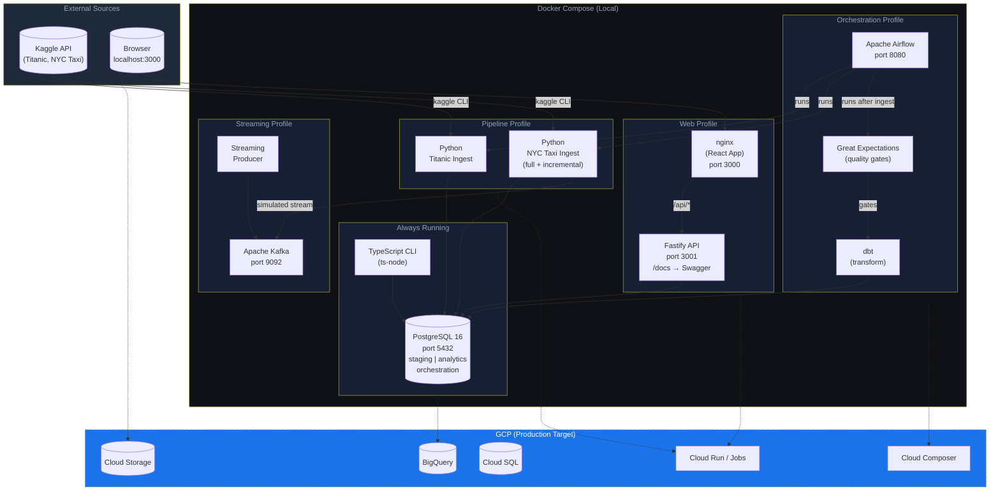

# Production Data Platform Architecture

This repository serves as a functional blueprint for the architectural patterns I implement when building production-grade data platforms. Structured as a modular monorepo, every component—including ingestion pipelines, orchestration, transformation layers, and APIs—is engineered to be independently deployable. While consolidated here for visibility, these modules are designed to exist in dedicated repositories at enterprise scale.

The objective of this project is not to showcase a specific toolkit, but to demonstrate a deep understanding of *why* these systems are architected this way. It reflects the trade-offs required to build systems that remain maintainable under real-world operational constraints, ensuring each layer adds clear value as the platform evolves.

My core production experience is centered on architecting enterprise-scale solutions using Google BigQuery and the GCP ecosystem. To ensure these patterns are portable and accessible without a cloud provider, the local stack leverages PostgreSQL and Docker. However, the `infra/` directory contains the GCP-targeting Terraform configurations that represent the intended production state, bridging the gap between local development and cloud-native deployment.


---

## What This Repo Demonstrates

This repository serves as a showcase for senior-level engineering patterns and modern data platform architecture:

| Competency | Implementation |
|---|---|
| **Data Pipeline Architecture** | Incremental loading with watermarks, SCD2 dimensions, idempotent upserts |
| **Data Quality** | Great Expectations validation gates blocking dbt runs on bad data |
| **Data Transformation** | dbt with sources, refs, schema tests, and documented staging models |
| **Orchestration** | Airflow DAG with retries, backfills, SLA callbacks, and operational metadata |
| **Streaming** | Kafka producer/consumer demo simulating real-time event ingestion |
| **API Design** | Fastify REST API with Zod validation, Swagger docs, and correlation IDs |
| **Observability** | OpenTelemetry tracing, structured logging, /metrics endpoint |
| **TypeScript** | Strict typed interfaces, generic query helpers, CLI with Commander |
| **Infrastructure** | Docker Compose profiles, multi-stage builds, health checks, Dependabot |
| **Testing** | Unit tests (schemas), integration tests (API routes with mocked DB) |
| **Documentation** | ADRs, migration guides, architecture diagrams, Swagger UI |

---

## Architecture



---

## What's in this repo

| Layer | Technology | Purpose |
|---|---|---|
| Database | PostgreSQL 16 (Docker) | Stores all data; two schemas: `staging` and `analytics` |
| Migrations | Raw SQL + shell loop | Versioned schema changes tracked in `db/migrations/` |
| Pipelines | Python + pandas | Download Kaggle datasets, clean, and bulk-load into Postgres |
| Orchestration | Airflow | Schedules ingestion, validation, dbt runs, retries, and backfills |
| Transformations | dbt | Builds analytics views with lineage, tests, and docs |
| Data Quality | Great Expectations | Validates staging data before downstream analytics build |
| CLI App | TypeScript + Node 20 | Terminal interface to query and explore data |
| CI/CD | GitHub Actions | Runs migrations and TS build checks on every push |
| Web API | Fastify (TypeScript) | REST API with full CRUD + Swagger docs |
| Web UI | React + Vite | Dashboard with charts, data tables, CRUD modals, admin panel |

*The web application is a demonstration interface for the data platform. The core engineering work is in `pipelines/`, `dbt/`, `orchestration/`, and `infra/`.*

## How this maps to production

| This repo | Production equivalent |
|---|---|
| Postgres in Docker | BigQuery (Analytics) + Cloud SQL (Metadata) |
| Airflow local | Cloud Composer (Managed Airflow) |
| Python pipelines | Cloud Run Jobs + GCS staging |
| GitHub Actions migrations | Terraform Cloud + Cloud Build |
| Docker Compose profiles | GKE namespaces or Cloud Run services |

---

## Quick Start

Get the platform running locally in minutes. For detailed requirements and troubleshooting, see the [Full Quick Start Guide](docs/guides/quick-start.md).

```bash
# 1. Setup Environment
cp .env.example .env

# 2. Start Database
docker compose up -d postgres

# 3. Seed Sample Data (Titanic subset)
cd web/server && npm install
cd ../client && npm install
cd ../../app && npm install && npx ts-node src/index.ts seed

# 4. Launch Full Stack (Dockerized)
cd ..
docker compose --profile web up --build
```
**Dashboard:** http://localhost:3000 | **API Docs:** http://localhost:3001/docs

---

## Detailed Usage

### TypeScript CLI
The CLI is used for terminal-based data exploration and administration.
```bash
cd app
npx ts-node src/index.ts ping                    # check DB connection
npx ts-node src/index.ts tables                  # list all tables + row counts
npx ts-node src/index.ts seed                    # load sample data

npx ts-node src/index.ts titanic list            # paginated passenger list
npx ts-node src/index.ts titanic list --limit 5  # first 5 rows
npx ts-node src/index.ts titanic summary         # survival rates by class & sex

npx ts-node src/index.ts taxi list               # recent NYC taxi trips
npx ts-node src/index.ts taxi list --min-fare 20 # trips with fare > $20
npx ts-node src/index.ts taxi hourly             # hourly analytics view

npx ts-node src/index.ts query "SELECT * FROM analytics.titanic_survival_summary"
```

See [CLI Reference](docs/reference/cli.md) for all commands and options.

---

## Running the data pipelines

Pipelines download real datasets from Kaggle and load them into Postgres.

**Setup (one-time):**
1. Create a Kaggle account at https://kaggle.com
2. Go to Account → API → Create New Token → download `kaggle.json`
3. Place it at `~/.kaggle/kaggle.json`
4. Accept competition rules at:
   - https://www.kaggle.com/c/titanic
   - https://www.kaggle.com/c/new-york-city-taxi-fare-prediction

**Run pipelines:**
```bash
# Via Docker (recommended)
docker compose --profile pipeline up pipeline_titanic
docker compose --profile pipeline up pipeline_nyc_taxi

# Or locally with Python
cd pipelines
pip install -r requirements.txt
POSTGRES_HOST=localhost python titanic/ingest.py
POSTGRES_HOST=localhost python nyc_taxi/ingest.py
POSTGRES_HOST=localhost python nyc_taxi/ingest.py --mode incremental
```

Charts are saved to `reports/`. After running, reload the dashboard to see live data.

The NYC Taxi pipeline supports incremental loading with persisted watermarks in `orchestration.pipeline_watermarks`; Airflow uses incremental mode by default.

---

## Running orchestration, dbt, and data quality

Start Airflow:

```bash
docker compose --profile orchestration up --build
```

Then open Airflow at http://localhost:8080 and trigger the `data_platform_batch` DAG.

Run dbt directly:

```bash
docker compose --profile transform run --rm dbt run --profiles-dir .
docker compose --profile transform run --rm dbt test --profiles-dir .
```

Run Great Expectations directly:

```bash
docker compose --profile quality run --rm great_expectations \
  python orchestration/great_expectations/validate.py titanic_staging
```

See [Orchestration Guide](docs/guides/orchestration.md) for the full workflow.

---

## REST API endpoints

The Fastify server exposes the following endpoints (all prefixed `/api`):

### Titanic
| Method | Path | Description |
|---|---|---|
| GET | `/api/titanic` | List passengers (supports `limit`, `offset`, `pclass`, `survived`, `sex`) |
| GET | `/api/titanic/:id` | Get single passenger |
| GET | `/api/titanic/stats` | Aggregate stats (total, survivors, rate) |
| GET | `/api/titanic/summary` | Survival breakdown from analytics view |
| POST | `/api/titanic` | Create passenger |
| PATCH | `/api/titanic/:id` | Update passenger |
| DELETE | `/api/titanic/:id` | Delete passenger |

### NYC Taxi
| Method | Path | Description |
|---|---|---|
| GET | `/api/taxi` | List trips (supports `limit`, `offset`, `min_fare`, `max_fare`) |
| GET | `/api/taxi/:id` | Get single trip |
| GET | `/api/taxi/stats` | Aggregate stats |
| GET | `/api/taxi/hourly` | Hourly aggregations from analytics view |
| POST | `/api/taxi` | Create trip |
| PATCH | `/api/taxi/:id` | Update trip |
| DELETE | `/api/taxi/:id` | Delete trip |

### Admin
| Method | Path | Description |
|---|---|---|
| GET | `/api/admin/tables` | All tables with row counts and sizes |
| GET | `/api/admin/tables/:schema/:table/columns` | Column metadata for a table |
| GET | `/api/admin/db-info` | Postgres version, DB size, schemas |
| POST | `/api/admin/query` | Run a safe read-only SELECT query |

Full interactive docs at http://localhost:3001/docs (Swagger UI).

---

## Docker reference

```bash
# Start Postgres only
docker compose up -d postgres

# Start the full web app (API + UI)
docker compose --profile web up --build

# Start a specific pipeline
docker compose --profile pipeline up pipeline_titanic

# View logs
docker compose logs -f web_server
docker compose logs -f postgres

# Stop everything (data preserved)
docker compose down

# Stop and wipe data (fresh start)
docker compose down -v
```

---

## Documentation

Full documentation lives in `docs/`. Start at **[docs/INDEX.md](./docs/INDEX.md)**.

| I want to... | Document |
|---|---|
| Understand the system design | [Architecture Overview](docs/architecture/overview.md) |
| Learn how the web app is structured | [Web App Guide](docs/guides/web-app.md) |
| Learn how the database is structured | [Database Design](docs/architecture/database-design.md) |
| Understand Docker and containers | [Docker & Containers](docs/architecture/docker.md) |
| Learn how CI/CD works | [CI/CD Pipeline](docs/architecture/cicd.md) |
| Add a new dataset pipeline | [Adding a Pipeline](docs/guides/adding-a-pipeline.md) |
| Write a database migration | [Migrations Guide](docs/guides/migrations.md) |
| Work on the TypeScript CLI | [TypeScript App Guide](docs/guides/typescript-app.md) |
| See all CLI commands | [CLI Reference](docs/reference/cli.md) |
| Look up environment variables | [Environment Variables](docs/reference/environment-variables.md) |

See [DEVELOPER_GUIDE](./DEVELOPER_GUIDE) for AI assistant context and conventions.