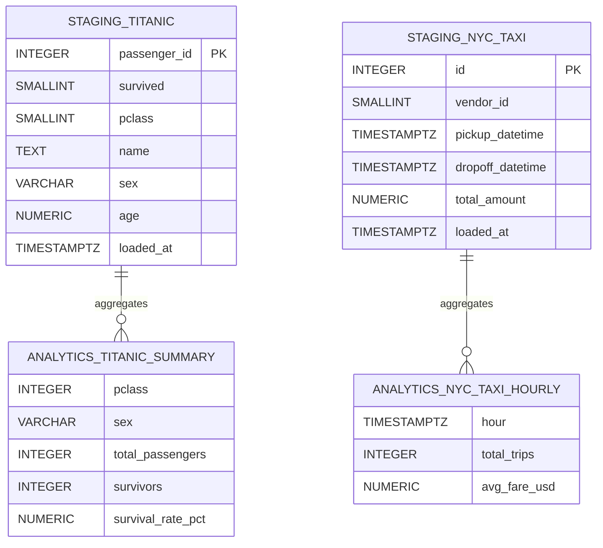

# Database Design

This document explains the Postgres database structure — how it is organised, why it is designed that way, and how to navigate it.

---

## What is PostgreSQL?

PostgreSQL (commonly called Postgres) is a relational database — a system for storing structured data in tables with rows and columns, and querying it with SQL. It is one of the most widely used databases in the world, and the de facto standard for serious open-source data work.

In this project, Postgres runs inside a Docker container so you do not need to install it on your Mac directly.

---

## Schemas: the two-layer pattern

Postgres supports **schemas** — namespaces that group tables together, similar to folders on a filesystem. This project uses two:

```
poc_db (the database)
├── staging        ← raw, freshly ingested data
│   ├── titanic
│   └── nyc_taxi
└── analytics      ← cleaned, aggregated data and views
    ├── titanic_survival_summary  (view)
    └── nyc_taxi_hourly           (view)
```

### Why two schemas?

**`staging`** is the landing zone. Data arrives here exactly as it came from the source — column names normalised but values untouched. If a source has nulls, bad values, or quirks, they are preserved in staging. This is important because:

- You can always see what the raw source data looked like
- You can re-run transformations without re-downloading data
- Bugs in your analytics logic don't require a full re-ingest to fix

**`analytics`** is the serving layer. It contains SQL views that transform, aggregate, and clean staging data into shapes useful for querying. Views are not stored — they re-run the underlying SQL every time you query them. This means they always reflect the latest data in staging.

### Medallion-style implementation (bronze/silver/gold)

This project uses a lightweight medallion pattern to separate concerns and make evolution tractable. The `staging` schema is the bronze (raw) layer where ingested data is persisted with minimal modification. The `analytics` schema contains the silver/gold transforms — curated views and aggregates built from staging that are tuned for analysis and reporting. An orchestration layer (job schedules, orchestration schema or service) sits alongside these schemas to manage scheduling, retries, lineage, and operational metadata so that freshness, error handling, and observability are first-class.

The PoC intentionally implements this pattern with Postgres tables and SQL views so the design is simple and inspectable; the same pattern maps naturally to Databricks or BigQuery where bronze/silver/gold correspond to raw ingestion tables, curated transform tables, and serving/aggregation tables or materialized views.



---

## Tables

### `staging.titanic`

Stores one row per passenger from the Kaggle Titanic dataset.

| Column | Type | Description |
|---|---|---|
| `id` | SERIAL | Auto-incrementing primary key (added by us) |
| `passenger_id` | INTEGER | Original Titanic passenger ID from Kaggle |
| `survived` | SMALLINT | 1 = survived, 0 = did not survive |
| `pclass` | SMALLINT | Ticket class: 1 = First, 2 = Second, 3 = Third |
| `name` | TEXT | Full passenger name |
| `sex` | VARCHAR(10) | `male` or `female` |
| `age` | NUMERIC(5,2) | Age in years; NULL if unknown |
| `sib_sp` | SMALLINT | Number of siblings or spouses aboard |
| `parch` | SMALLINT | Number of parents or children aboard |
| `ticket` | VARCHAR(50) | Ticket number (alphanumeric) |
| `fare` | NUMERIC(10,4) | Fare paid in British pounds |
| `cabin` | VARCHAR(20) | Cabin number; NULL for most passengers |
| `embarked` | CHAR(1) | Port of embarkation: C=Cherbourg, Q=Queenstown, S=Southampton |
| `loaded_at` | TIMESTAMPTZ | Timestamp when this row was inserted |

### `staging.nyc_taxi`

Stores one row per taxi trip from the NYC Taxi dataset (capped at 50,000 rows for the PoC).

| Column | Type | Description |
|---|---|---|
| `id` | SERIAL | Auto-incrementing primary key |
| `vendor_id` | SMALLINT | Taxi vendor/company ID |
| `pickup_datetime` | TIMESTAMPTZ | Trip start time (with timezone) |
| `dropoff_datetime` | TIMESTAMPTZ | Trip end time |
| `passenger_count` | SMALLINT | Number of passengers (1–6) |
| `trip_distance` | NUMERIC(8,2) | Distance in miles |
| `pickup_longitude` | NUMERIC(11,6) | GPS longitude of pickup |
| `pickup_latitude` | NUMERIC(11,6) | GPS latitude of pickup |
| `rate_code_id` | SMALLINT | Rate type (1=standard, 2=JFK, etc.) |
| `store_and_fwd_flag` | CHAR(1) | Y/N — was trip stored offline before upload |
| `dropoff_longitude` | NUMERIC(11,6) | GPS longitude of dropoff |
| `dropoff_latitude` | NUMERIC(11,6) | GPS latitude of dropoff |
| `payment_type` | SMALLINT | 1=credit card, 2=cash, 3=no charge, etc. |
| `fare_amount` | NUMERIC(8,2) | Base fare in USD |
| `extra` | NUMERIC(8,2) | Extras and surcharges |
| `mta_tax` | NUMERIC(8,2) | MTA tax |
| `tip_amount` | NUMERIC(8,2) | Tip amount |
| `tolls_amount` | NUMERIC(8,2) | Tolls |
| `total_amount` | NUMERIC(8,2) | Total charged |
| `loaded_at` | TIMESTAMPTZ | Insertion timestamp |

---

## Views (analytics schema)

Views are saved SQL queries. When you query a view, Postgres runs the underlying SQL on the fly against the current data in staging.

### `analytics.titanic_survival_summary`

Aggregates survival rates by passenger class and sex.

```sql
SELECT
  pclass,
  sex,
  COUNT(*)                    AS total_passengers,
  SUM(survived)               AS survivors,
  ROUND(AVG(survived)*100, 2) AS survival_rate_pct,
  ROUND(AVG(age), 1)          AS avg_age,
  ROUND(AVG(fare), 2)         AS avg_fare
FROM staging.titanic
WHERE age IS NOT NULL
GROUP BY pclass, sex
ORDER BY pclass, sex;
```

Sample output:

| pclass | sex | total_passengers | survivors | survival_rate_pct | avg_age | avg_fare |
|---|---|---|---|---|---|---|
| 1 | female | 85 | 80 | 94.12 | 34.6 | 106.13 |
| 1 | male | 101 | 36 | 35.64 | 41.3 | 67.23 |
| 3 | male | 300 | 47 | 15.67 | 26.5 | 8.10 |

### `analytics.nyc_taxi_hourly`

Aggregates trip metrics by hour of day.

```sql
SELECT
  DATE_TRUNC('hour', pickup_datetime) AS hour,
  COUNT(*)                            AS total_trips,
  ROUND(AVG(trip_distance), 2)        AS avg_distance_miles,
  ROUND(AVG(total_amount), 2)         AS avg_fare_usd,
  ROUND(AVG(tip_amount), 2)           AS avg_tip_usd,
  SUM(passenger_count)                AS total_passengers
FROM staging.nyc_taxi
WHERE pickup_datetime IS NOT NULL
GROUP BY 1
ORDER BY 1;
```

---

## Dimension Modeling: SCD Type 2

The `analytics.dim_titanic_scd2` table demonstrates the **Type 2 Slowly Changing Dimension**
pattern — a foundational data warehousing concept for tracking historical changes.

### Why SCD2?

Simple overwrite (SCD Type 1) loses history. For analytical questions like "how did
our understanding of this data change over time?" or "what was the state of this record
on a specific date?", you need to preserve history.

### How to Query Current Records

```sql
SELECT * FROM analytics.dim_titanic_current;
-- Equivalent to: WHERE is_current = TRUE
```

### How to Query a Record at a Point in Time

```sql
SELECT * FROM analytics.dim_titanic_scd2
WHERE passenger_id = 2
  AND valid_from <= '2024-01-15'::timestamptz
  AND (valid_to IS NULL OR valid_to > '2024-01-15'::timestamptz);
```

### How to See All Versions of a Record

```sql
SELECT * FROM analytics.dim_titanic_history
WHERE passenger_id = 2
ORDER BY version_number;
```

---

## Migrations: how the schema gets created

The schema is not created by hand — it is built by running numbered SQL scripts in order. This is called **database migration**.

Migration files live in `db/migrations/` and are named with a numeric prefix:

```
001_init_schemas.sql    ← Create the staging and analytics schemas
002_create_titanic.sql  ← Create staging.titanic table + analytics view
003_create_nyc_taxi.sql ← Create staging.nyc_taxi table + analytics view
```

**The number prefix is critical.** Migrations must always run in order because later migrations can depend on objects created by earlier ones. Never rename or reorder migration files.

When you first start the Postgres container via Docker Compose, the `db/migrations/` folder is mounted as the container's init directory. Postgres automatically runs all `.sql` files in that folder on first startup (when the data volume is empty).

For a full guide on writing new migrations, see [Database Migrations Guide](../guides/migrations.md).

---

## Indexes

Indexes speed up queries by letting Postgres find rows without scanning the whole table. Two indexes are defined on `staging.nyc_taxi`:

```sql
CREATE INDEX idx_nyc_taxi_pickup_dt  ON staging.nyc_taxi (pickup_datetime);
CREATE INDEX idx_nyc_taxi_passenger  ON staging.nyc_taxi (passenger_count);
```

These make time-range queries and passenger-count filters fast, which are the most common access patterns for taxi data.

No indexes are defined on `staging.titanic` because it is a small table (under 1,000 rows) where a full table scan is always fast enough.

---

## Naming conventions

| Pattern | Example | Meaning |
|---|---|---|
| Snake case | `passenger_id`, `pickup_datetime` | All columns and tables use underscores |
| `_at` suffix | `loaded_at`, `pickup_datetime` | Timestamps |
| `staging.` prefix | `staging.titanic` | Raw ingestion table |
| `analytics.` prefix | `analytics.titanic_survival_summary` | Aggregated view |
| Numeric prefix | `001_init_schemas.sql` | Migration ordering |

---

## Connecting to the database

**Via the TypeScript app (recommended)**
```bash
cd app
npx ts-node src/index.ts ping
npx ts-node src/index.ts tables
```

**Via psql (command line)**
```bash
PGPASSWORD=poc_password psql -h localhost -U poc_user -d poc_db
```

**Via a GUI client (TablePlus, DBeaver, etc.)**
```
Host:     localhost
Port:     5432
Database: poc_db
User:     poc_user
Password: poc_password
```

**Useful psql commands once connected**
```sql
\dn              -- list schemas
\dt staging.*    -- list tables in staging schema
\d staging.titanic  -- describe table structure
SELECT * FROM analytics.titanic_survival_summary;
```
