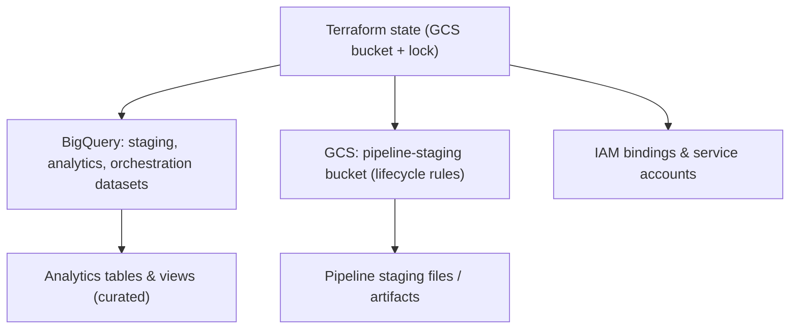

# Infrastructure (infra)

This directory contains Terraform scaffolding and small example modules that illustrate how the repository's data platform components could be provisioned on Google Cloud (GCP). The code is intentionally lightweight and intended as a practitioner reference — copy-and-adapt for experiments rather than a turnkey production deployment.

_This configuration targets GCP and reflects the production patterns I work with professionally. The main PoC stack runs locally via Docker Compose for portability. See the "How this maps to production" table in the root README._

## Why Terraform
Terraform provides reproducibility, auditability, and environment parity: infrastructure-as-code lets teams version, review, and automate changes instead of clicking through the Console. That makes infrastructure changes auditable, repeatable, and suitable for CI/CD.

## Structure
- `modules/`: reusable Terraform modules (bigquery, gcs, iam)
- `environments/`: environment-specific instantiations (dev, prod)
- `main.tf`, `variables.tf`, `outputs.tf`: root-level composition and outputs

## Module boundaries and rationale
- `bigquery/` module provisions datasets, service accounts, and dataset-level IAM. Dataset lifecycle and data retention belong here.
- `gcs/` module manages buckets used for pipeline staging and lifecycle rules (short-lived objects).
- `iam/` module centralizes cross-cutting role definitions and bindings so IAM policy changes are auditable and scoped.

These boundaries reflect different change cadences and ownership models in production: storage and dataset schemas change less frequently than pipeline orchestration, and IAM is often managed by a platform or security team.

## Initialize & apply (dev)
1. Copy the example variables and edit as needed:
   ```powershell
   cp environments\dev\terraform.tfvars.example environments\dev\terraform.tfvars
   # Edit environments\dev\terraform.tfvars to set project_id and bucket names
   ```
2. Initialize Terraform (local/backend configuration may be required):
   ```powershell
   terraform init -backend-config="path=dev.tfstate"  # or provide GCS backend config
   terraform fmt
   terraform validate
   ```
3. Plan and apply (review plan before applying):
   ```powershell
   terraform plan -var-file=environments\dev\terraform.tfvars
   terraform apply -var-file=environments\dev\terraform.tfvars
   ```
**Caution:** Do not run `apply` against production resources without approvals and proper backend locking (GCS backend + remote state locking recommended).

## How this maps to production
In production this repo would use a remote state backend (GCS) with state locking, globally-unique bucket names, CMEK for sensitive data, Private Service Connect, and a more restrictive IAM posture. The `environments/prod/` directory contains a README describing those additions rather than an automated prod rollout.

### Simple diagram (Terraform state → running services)


## Note on `environments/prod/`
The `environments/prod/` directory intentionally contains only a README that explains what a production deployment would include (VPC, Private Service Connect, CMEK, more restrictive IAM, managed Composer, remote state locking). This keeps the PoC honest: production changes require approvals and governance.

## Usage & cautions
- Provide GCP credentials (ADC or service account) before running commands that touch GCP.
- Bucket names must be globally unique in GCP; choose stable, environment-scoped names.
- This repo is a reference implementation. Treat `dev/` examples as starting points, not production automation.

---

If you want, confirm and I will stage this change for commit and suggest a Conventional Commit message (docs: infra README).
