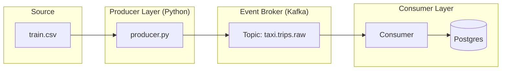

# Streaming Demo: Real-time Taxi Ingestion

This module demonstrates a modern event-driven architecture using **Apache Kafka**. It simulates a real-time taxi dispatch system by streaming historical NYC Taxi trip data as a series of JSON events.

## Architecture



## What This Demonstrates

*   **Event-Driven Patterns:** Transitioning from batch processing to asynchronous event streams.
*   **Production-Grade Producer Config:** The producer is configured with `acks='all'`, `retries=3`, and `linger_ms=10` to balance durability with throughput.
*   **Consistent Partitioning:** Events are keyed by `vendor_id`. In a multi-partition Kafka setup, this ensures that all events for a specific taxi vendor are processed in strict chronological order.
*   **Realistic Event Schemas:** Transformation of tabular CSV data into a nested JSON structure with event metadata (e.g., `event_type`, `event_time`).

## Getting Started

### 1. Start the Infrastructure
Kafka and Zookeeper are managed via the `streaming` Docker Compose profile.

```bash
docker compose --profile streaming up -d
```

### 2. Run the Producer
The producer requires the NYC Taxi dataset to be present in `pipelines/nyc_taxi/data/`. Run the standard taxi pipeline first if this is a fresh clone.

```bash
# Default rate is 5 events per second
python producer.py --rate 10
```

### 3. Verify the Stream
You can peek into the Kafka topic using the console consumer bundled with the Docker image:

```bash
docker exec -it poc_kafka kafka-console-consumer \
  --bootstrap-server localhost:9092 \
  --topic taxi.trips.raw \
  --from-beginning
```

---
*This is a sub-module of the Data Platform PoC.*