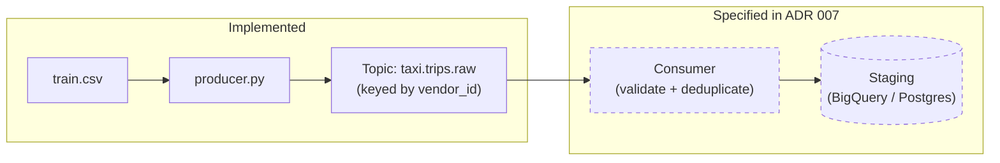

# Streaming Architecture — Design Reference and Producer Implementation

## Scope and Status

This module implements the **producer layer** of a Kafka-based 
streaming architecture. The consumer layer, schema registry 
integration, and GCP Pub/Sub alternative are documented as an 
architectural decision rather than implemented here.

This is a deliberate scope boundary, not an incomplete implementation.

**Why the boundary is here:**  
The producer demonstrates the event schema design, partition key 
rationale, and Kafka producer configuration that matter for an 
architecture review. The consumer's behavior — validate, deduplicate 
on `source_row_hash`, write to staging — is fully specified in the 
ADR. Implementing a consumer that writes to the same Postgres instance 
already served by the batch pipeline would demonstrate the same 
database write pattern twice without adding architectural signal.

In a production system, the consumer would target a separate landing 
zone (BigQuery staging, GCS) and would be owned by a separate service 
with its own deployment lifecycle. That separation is the point, and 
it is documented rather than simulated.

**Full design specification:**  
[ADR 007 — Streaming Architecture](../../docs/decisions/007-streaming-architecture.md)

---

## What This Module Demonstrates

- **Event schema design:** tabular CSV data transformed into a 
  structured JSON envelope with event metadata
- **Producer configuration:** `acks='all'`, `retries=3`, 
  `linger_ms=10` — the tradeoffs between durability and throughput 
  made explicit in code
- **Partition key reasoning:** `vendor_id` as partition key for 
  ordering guarantees per vendor, with the skew tradeoff documented
- **Throughput control:** configurable `--rate` flag simulating 
  real-world event velocity constraints

---

## Architecture



---

## Getting Started

### Prerequisites

Start the Kafka infrastructure:

```bash
docker compose --profile streaming up -d
```

The NYC Taxi dataset must be present. Run the batch pipeline first 
if this is a fresh clone:

```bash
docker compose --profile pipeline up pipeline_nyc_taxi
```

### Run the Producer

```bash
cd pipelines/streaming

# Default: 5 events per second
python producer.py --rate 5

# Unlimited throughput (testing)
python producer.py --rate 0
```

### Verify Events Are Landing

```bash
docker exec -it poc_kafka kafka-console-consumer \
  --bootstrap-server localhost:9092 \
  --topic taxi.trips.raw \
  --from-beginning
```

---

## Producer Configuration Decisions

| Setting | Value | Rationale |
|---|---|---|
| `acks='all'` | all replicas | Durability over throughput — events must survive broker failure |
| `retries=3` | 3 | Transient failure tolerance without infinite retry loops |
| `linger_ms=10` | 10ms | Micro-batching to improve throughput without meaningful latency cost |
| `batch_size=16384` | 16KB | Standard Kafka default — appropriate for JSON payloads at this scale |
| Partition key | `vendor_id` | Ordering guarantee per vendor; skew tradeoff documented in ADR 007 |

---

## Event Schema

```json
{
  "event_type": "trip_completed",
  "event_time": "2024-01-15T09:32:00.000Z",
  "vendor_id": 1,
  "pickup_datetime": "2015-01-15 09:32:00",
  "dropoff_datetime": "2015-01-15 09:45:00",
  "passenger_count": 2,
  "trip_distance": 3.5,
  "fare_amount": 14.50,
  "tip_amount": 2.00,
  "total_amount": 16.50
}
```

**Schema evolution strategy** is documented in 
[ADR 007](../../docs/decisions/007-streaming-architecture.md) — 
specifically the Schema Registry section and the compatibility 
rules that govern producer/consumer coordination across versions.

---

## What the Consumer Would Do

Per ADR 007, the consumer responsibilities are:

1. Read from `taxi.trips.raw`
2. Validate the event envelope and payload schema
3. Route invalid events to `taxi.trips.invalid` with metrics
4. Deduplicate on `source_row_hash` before writing to staging
5. Write to the staging target (BigQuery or Postgres) with 
   idempotent upsert semantics

This is the same deduplication pattern used in the batch pipeline 
(`pipelines/nyc_taxi/ingest.py`) — `source_row_hash` as the 
idempotency key is consistent across both ingestion paths by design.

---

*Part of the Production Data Platform PoC.  
See the [root README](../../README.md) for full architecture.*